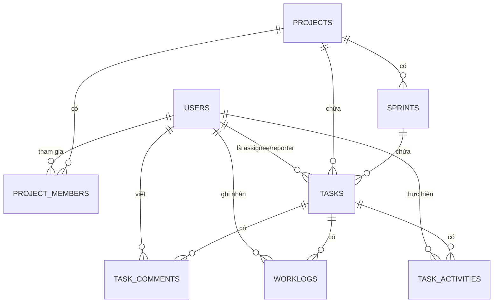

# DATABASE DESIGN
## Mini Project Management System (Jira-like)

| Thông tin tài liệu | |
|---|---|
| Phiên bản | 1.0 |
| Nguồn | Biên soạn dựa trên SRS, System Architecture, API Spec đã có |
| DBMS | PostgreSQL 16 |
| Trạng thái DDL | Đã chạy thử thành công + test ràng buộc nghiệp vụ trên PostgreSQL thật |

---

## 1. Sơ đồ quan hệ (ERD)



---

## 2. Quyết định thiết kế: bỏ bảng `roles` riêng

Tài liệu yêu cầu gốc liệt kê `roles` như một bảng độc lập, nhưng SRS mục 8.2 đã đánh dấu đây là điểm cần xác nhận. API Spec đã chốt `role` cấp hệ thống (System Role) là **enum cố định 2 giá trị** (`ADMIN`/`USER`).

**Quyết định:** Không tạo bảng `roles` riêng, dùng cột `role VARCHAR + CHECK constraint` ngay trên bảng `users` (`ADMIN` hoặc `USER`) — tránh JOIN không cần thiết, đơn giản hơn cho timeline 5 ngày. Các quyền cụ thể của người dùng trong dự án sẽ được quyết định bởi **Project Role** (`PM`/`DEV`/`TESTER`) lưu trực tiếp trên bảng `project_members`.

Đồng thời, cơ chế xác thực JWT là hoàn toàn **stateless** phía Backend. Backend chỉ đảm nhận việc verify token, không cần lưu trữ hay quản lý trạng thái token trong DB. Vì vậy, bảng `refresh_tokens` được loại bỏ hoàn toàn. Tổng số bảng trong Database thực tế giảm còn **8 bảng**.

---

## 3. Chi tiết từng bảng

### 3.1 `users`

| Cột | Kiểu dữ liệu | Ràng buộc | Ghi chú |
|---|---|---|---|
| id | BIGSERIAL | PK | |
| employee_id | VARCHAR(50) | NOT NULL, UNIQUE | |
| username | VARCHAR(50) | NOT NULL, UNIQUE | |
| password_hash | VARCHAR(255) | NOT NULL | Băm BCrypt (NFR-02) |
| full_name | VARCHAR(150) | NOT NULL | |
| email | VARCHAR(150) | NOT NULL, UNIQUE | |
| role | VARCHAR(20) | NOT NULL, CHECK IN (ADMIN, USER) | System Role |
| status | VARCHAR(20) | NOT NULL, DEFAULT 'ACTIVE', CHECK IN (ACTIVE, LOCKED) | |
| created_at / updated_at | TIMESTAMP | NOT NULL, DEFAULT now() | |
| created_by / updated_by | BIGINT | | Audit field (BaseEntity) |


### 3.3 `projects`

| Cột | Kiểu dữ liệu | Ràng buộc | Ghi chú |
|---|---|---|---|
| id | BIGSERIAL | PK | |
| project_code | VARCHAR(20) | NOT NULL, UNIQUE | |
| project_name | VARCHAR(200) | NOT NULL | |
| description | TEXT | | |
| start_date / end_date | DATE | NOT NULL, CHECK end_date >= start_date | |
| status | VARCHAR(20) | NOT NULL, CHECK IN (PLANNING, ACTIVE, ON_HOLD, COMPLETED) | |
| created_at / updated_at / created_by / updated_by | | | Audit field |

### 3.4 `project_members`

| Cột | Kiểu dữ liệu | Ràng buộc | Ghi chú |
|---|---|---|---|
| id | BIGSERIAL | PK | |
| project_id | BIGINT | FK → projects(id) ON DELETE CASCADE | |
| user_id | BIGINT | FK → users(id) ON DELETE CASCADE | |
| project_role | VARCHAR(20) | NOT NULL, CHECK IN (PM, DEV, TESTER) | |
| status | VARCHAR(20) | NOT NULL, DEFAULT 'ACTIVE', CHECK IN (ACTIVE, INACTIVE) | Trạng thái hoạt động trong dự án (soft-delete) |
| created_at | TIMESTAMP | NOT NULL, DEFAULT now() | |
| **UNIQUE** | (project_id, user_id) | | Một User chỉ được thêm 1 lần / Project |

### 3.5 `sprints`

| Cột | Kiểu dữ liệu | Ràng buộc | Ghi chú |
|---|---|---|---|
| id | BIGSERIAL | PK | |
| project_id | BIGINT | FK → projects(id) ON DELETE CASCADE | |
| sprint_name | VARCHAR(200) | NOT NULL | |
| goal | TEXT | | |
| start_date / end_date | DATE | NOT NULL, CHECK end_date >= start_date | |
| status | VARCHAR(20) | NOT NULL, DEFAULT 'PLANNED', CHECK IN (PLANNED, ACTIVE, CLOSED) | |
| created_at / updated_at / created_by / updated_by | | | Audit field |

**Ràng buộc nghiệp vụ (FR-SPR-02):** một Project chỉ được có tối đa 1 Sprint ở trạng thái `ACTIVE` — hiện thực bằng **partial unique index** trên `(project_id) WHERE status = 'ACTIVE'`, đã test thực tế (mục 6).

### 3.6 `tasks`

| Cột | Kiểu dữ liệu | Ràng buộc | Ghi chú |
|---|---|---|---|
| id | BIGSERIAL | PK | |
| task_key | VARCHAR(30) | NOT NULL, UNIQUE | vd `WEB-101`, sinh tự động theo Project Code (*) |
| project_id | BIGINT | FK → projects(id) ON DELETE CASCADE | |
| sprint_id | BIGINT | FK → sprints(id) ON DELETE SET NULL | Nullable — Task có thể chưa gán Sprint |
| summary | VARCHAR(500) | NOT NULL | |
| description | TEXT | | |
| task_type | VARCHAR(20) | NOT NULL, CHECK IN (STORY, TASK, BUG) | |
| priority | VARCHAR(20) | NOT NULL, CHECK IN (LOW, MEDIUM, HIGH, CRITICAL) | |
| status | VARCHAR(20) | NOT NULL, DEFAULT 'TODO', CHECK IN (TODO, IN_PROGRESS, TESTING, DONE) | |
| assignee_id | BIGINT | FK → users(id), nullable | |
| reporter_id | BIGINT | FK → users(id), NOT NULL | |
| story_point | NUMERIC(5,2) | | |
| estimate_hour | NUMERIC(6,2) | | |
| due_date | DATE | | |
| created_at / updated_at / created_by / updated_by | | | Audit field |

> Luồng trạng thái hợp lệ (`TODO→IN_PROGRESS→TESTING→DONE`, `IN_PROGRESS→TODO`) và ràng buộc "chỉ sửa 4 field" (FR-TASK-02) là **business rule ở Service Layer**, không hiện thực bằng CHECK constraint ở DB — vì luồng chuyển trạng thái phụ thuộc giá trị hiện tại (stateful), không phù hợp CHECK constraint tĩnh.

### 3.7 `task_comments`

| Cột | Kiểu dữ liệu | Ràng buộc | Ghi chú |
|---|---|---|---|
| id | BIGSERIAL | PK | |
| task_id | BIGINT | FK → tasks(id) ON DELETE CASCADE | |
| content | TEXT | NOT NULL | |
| created_by | BIGINT | FK → users(id), NOT NULL | |
| created_time | TIMESTAMP | NOT NULL, DEFAULT now() | |

### 3.8 `worklogs`

| Cột | Kiểu dữ liệu | Ràng buộc | Ghi chú |
|---|---|---|---|
| id | BIGSERIAL | PK | |
| task_id | BIGINT | FK → tasks(id) ON DELETE CASCADE | |
| user_id | BIGINT | FK → users(id), NOT NULL | Người log work |
| work_date | DATE | NOT NULL | |
| hour | NUMERIC(4,2) | NOT NULL, **CHECK (hour > 0 AND hour <= 24)** | Ràng buộc FR-WLOG-01, đã test thực tế |
| description | TEXT | | |
| created_at | TIMESTAMP | NOT NULL, DEFAULT now() | |

### 3.9 `task_activities`

| Cột | Kiểu dữ liệu | Ràng buộc | Ghi chú |
|---|---|---|---|
| id | BIGSERIAL | PK | |
| task_id | BIGINT | FK → tasks(id) ON DELETE CASCADE | |
| user_id | BIGINT | FK → users(id), NOT NULL | |
| action | VARCHAR(30) | NOT NULL, CHECK IN (TASK_CREATED, STATUS_CHANGED, PRIORITY_CHANGED, ASSIGNEE_CHANGED, COMMENT_ADDED) | |
| old_value / new_value | VARCHAR(255) | nullable | |
| created_time | TIMESTAMP | NOT NULL, DEFAULT now() | |

---

## 4. Chỉ mục (Index) — đáp ứng NFR-05

| Bảng | Index | Lý do |
|---|---|---|
| tasks | project_id, sprint_id, status, priority, assignee_id | Phục vụ Task Search đa điều kiện (FR-TASK-04) |
| worklogs | task_id, work_date | Phục vụ Worklog Report (FR-RPT-01) |
| task_activities | task_id, created_time | Phục vụ xem Activity History theo thời gian (FR-ACT-02) |
| project_members | project_id, user_id | Phục vụ kiểm tra quyền Project Role (Architecture mục 5.2) |
| sprints | project_id | Phục vụ liệt kê Sprint theo Project (FR-SPR-03) |

---

## 5. DDL đầy đủ (đã chạy thử thành công trên PostgreSQL 16)

```sql
CREATE TABLE users (
    id              BIGSERIAL PRIMARY KEY,
    employee_id     VARCHAR(50)  NOT NULL UNIQUE,
    username        VARCHAR(50)  NOT NULL UNIQUE,
    password_hash   VARCHAR(255) NOT NULL,
    full_name       VARCHAR(150) NOT NULL,
    email           VARCHAR(150) NOT NULL UNIQUE,
    role            VARCHAR(20)  NOT NULL CHECK (role IN ('ADMIN','USER')),
    status          VARCHAR(20)  NOT NULL DEFAULT 'ACTIVE' CHECK (status IN ('ACTIVE','LOCKED')),
    created_at      TIMESTAMP NOT NULL DEFAULT now(),
    updated_at      TIMESTAMP NOT NULL DEFAULT now(),
    created_by      BIGINT,
    updated_by      BIGINT
);

CREATE TABLE projects (
    id              BIGSERIAL PRIMARY KEY,
    project_code    VARCHAR(20)  NOT NULL UNIQUE,
    project_name    VARCHAR(200) NOT NULL,
    description     TEXT,
    start_date      DATE NOT NULL,
    end_date        DATE NOT NULL,
    status          VARCHAR(20) NOT NULL CHECK (status IN ('PLANNING','ACTIVE','ON_HOLD','COMPLETED')),
    created_at      TIMESTAMP NOT NULL DEFAULT now(),
    updated_at      TIMESTAMP NOT NULL DEFAULT now(),
    created_by      BIGINT REFERENCES users(id),
    updated_by      BIGINT REFERENCES users(id),
    CONSTRAINT chk_project_dates CHECK (end_date >= start_date)
);

CREATE TABLE project_members (
    id              BIGSERIAL PRIMARY KEY,
    project_id      BIGINT NOT NULL REFERENCES projects(id) ON DELETE CASCADE,
    user_id         BIGINT NOT NULL REFERENCES users(id) ON DELETE CASCADE,
    project_role    VARCHAR(20) NOT NULL CHECK (project_role IN ('PM','DEV','TESTER')),
    status          VARCHAR(20) NOT NULL DEFAULT 'ACTIVE' CHECK (status IN ('ACTIVE','INACTIVE')),
    created_at      TIMESTAMP NOT NULL DEFAULT now(),
    CONSTRAINT ux_project_member UNIQUE (project_id, user_id)
);

CREATE TABLE sprints (
    id              BIGSERIAL PRIMARY KEY,
    project_id      BIGINT NOT NULL REFERENCES projects(id) ON DELETE CASCADE,
    sprint_name     VARCHAR(200) NOT NULL,
    goal            TEXT,
    start_date      DATE NOT NULL,
    end_date        DATE NOT NULL,
    status          VARCHAR(20) NOT NULL DEFAULT 'PLANNED' CHECK (status IN ('PLANNED','ACTIVE','CLOSED')),
    created_at      TIMESTAMP NOT NULL DEFAULT now(),
    updated_at      TIMESTAMP NOT NULL DEFAULT now(),
    created_by      BIGINT REFERENCES users(id),
    updated_by      BIGINT REFERENCES users(id),
    CONSTRAINT chk_sprint_dates CHECK (end_date >= start_date)
);

-- Ràng buộc: 1 project chỉ có tối đa 1 sprint ACTIVE tại 1 thời điểm
CREATE UNIQUE INDEX ux_sprint_one_active_per_project
    ON sprints (project_id)
    WHERE status = 'ACTIVE';

CREATE TABLE tasks (
    id              BIGSERIAL PRIMARY KEY,
    task_key        VARCHAR(30) NOT NULL UNIQUE,
    project_id      BIGINT NOT NULL REFERENCES projects(id) ON DELETE CASCADE,
    sprint_id       BIGINT REFERENCES sprints(id) ON DELETE SET NULL,
    summary         VARCHAR(500) NOT NULL,
    description     TEXT,
    task_type       VARCHAR(20) NOT NULL CHECK (task_type IN ('STORY','TASK','BUG')),
    priority        VARCHAR(20) NOT NULL CHECK (priority IN ('LOW','MEDIUM','HIGH','CRITICAL')),
    status          VARCHAR(20) NOT NULL DEFAULT 'TODO' CHECK (status IN ('TODO','IN_PROGRESS','TESTING','DONE')),
    assignee_id     BIGINT REFERENCES users(id),
    reporter_id     BIGINT NOT NULL REFERENCES users(id),
    story_point     NUMERIC(5,2),
    estimate_hour   NUMERIC(6,2),
    due_date        DATE,
    created_at      TIMESTAMP NOT NULL DEFAULT now(),
    updated_at      TIMESTAMP NOT NULL DEFAULT now(),
    created_by      BIGINT REFERENCES users(id),
    updated_by      BIGINT REFERENCES users(id)
);

CREATE TABLE task_comments (
    id              BIGSERIAL PRIMARY KEY,
    task_id         BIGINT NOT NULL REFERENCES tasks(id) ON DELETE CASCADE,
    content         TEXT NOT NULL,
    created_by      BIGINT NOT NULL REFERENCES users(id),
    created_time    TIMESTAMP NOT NULL DEFAULT now()
);

CREATE TABLE worklogs (
    id              BIGSERIAL PRIMARY KEY,
    task_id         BIGINT NOT NULL REFERENCES tasks(id) ON DELETE CASCADE,
    user_id         BIGINT NOT NULL REFERENCES users(id),
    work_date       DATE NOT NULL,
    hour            NUMERIC(4,2) NOT NULL,
    description     TEXT,
    created_at      TIMESTAMP NOT NULL DEFAULT now(),
    CONSTRAINT chk_worklog_hour CHECK (hour > 0 AND hour <= 24)
);

CREATE TABLE task_activities (
    id              BIGSERIAL PRIMARY KEY,
    task_id         BIGINT NOT NULL REFERENCES tasks(id) ON DELETE CASCADE,
    user_id         BIGINT NOT NULL REFERENCES users(id),
    action          VARCHAR(30) NOT NULL CHECK (action IN
                        ('TASK_CREATED','STATUS_CHANGED','PRIORITY_CHANGED','ASSIGNEE_CHANGED','COMMENT_ADDED')),
    old_value       VARCHAR(255),
    new_value       VARCHAR(255),
    created_time    TIMESTAMP NOT NULL DEFAULT now()
);

-- ============================================================
-- Indexes (NFR-05: thời gian phản hồi < 3s với ~10.000 task)
-- ============================================================
CREATE INDEX idx_tasks_project_id   ON tasks(project_id);
CREATE INDEX idx_tasks_sprint_id    ON tasks(sprint_id);
CREATE INDEX idx_tasks_status       ON tasks(status);
CREATE INDEX idx_tasks_priority     ON tasks(priority);
CREATE INDEX idx_tasks_assignee_id  ON tasks(assignee_id);

CREATE INDEX idx_worklogs_task_id     ON worklogs(task_id);
CREATE INDEX idx_worklogs_work_date   ON worklogs(work_date);

CREATE INDEX idx_task_activities_task_id      ON task_activities(task_id);
CREATE INDEX idx_task_activities_created_time ON task_activities(created_time);

CREATE INDEX idx_project_members_project_id ON project_members(project_id);
CREATE INDEX idx_project_members_user_id    ON project_members(user_id);

CREATE INDEX idx_sprints_project_id ON sprints(project_id);
```

> File này chính là nội dung khuyến nghị cho Flyway migration `V1__init_schema.sql` (đúng như đã phân công cho Dev1 ở Ngày 1 trong kế hoạch task chi tiết).

---

## 6. Kết quả kiểm thử thực tế

DDL trên đã được chạy thật trên PostgreSQL 16 (không chỉ kiểm tra cú pháp tĩnh):

| Test | Kết quả |
|---|---|
| Tạo toàn bộ 8 bảng + tất cả index | ✅ Thành công, không lỗi |
| Insert 2 Sprint cùng trạng thái `ACTIVE` trong cùng 1 Project | ✅ Bị chặn đúng như thiết kế — `duplicate key value violates unique constraint "ux_sprint_one_active_per_project"` |
| Insert Worklog với `hour = 25` | ✅ Bị chặn — `violates check constraint "chk_worklog_hour"` |
| Insert Worklog với `hour = 0` | ✅ Bị chặn — `violates check constraint "chk_worklog_hour"` |
| Insert Worklog hợp lệ (`hour = 4`) | ✅ Thành công |

---

## 7. Ghi chú còn tồn đọng (cần xác nhận thêm)

1. Tài liệu gốc và SRS chỉ mô tả **Tạo/Cập nhật** cho Project, Sprint, Task — chưa có yêu cầu Xoá. Schema hiện tại dùng `ON DELETE CASCADE`/`SET NULL` cho các FK liên quan, giả định sẵn cho tương lai nếu chức năng Xoá được bổ sung; **hiện tại chưa có API xoá tương ứng** trong API Spec.
2. `password_hash` độ dài 255 ký tự — đủ cho BCrypt (thường ~60 ký tự), có dư để đổi thuật toán sau này.
3. Nếu về sau cần soft-delete thay vì xoá cứng, cần bổ sung cột `deleted_at` — chưa đưa vào bản v1.0 vì không có trong yêu cầu gốc.
