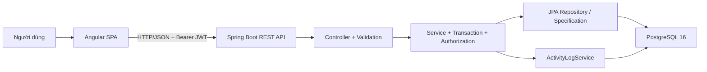
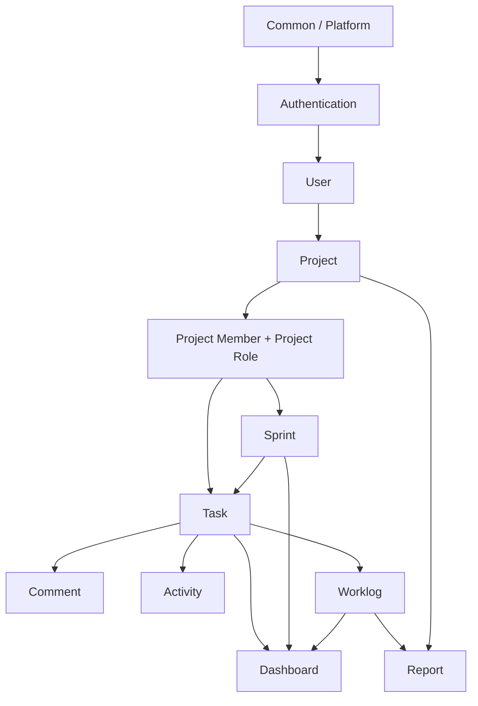

# Executive Summary

## Kết luận điều hành

Mini Project Management System là ứng dụng quản lý công việc nội bộ kiểu Jira thu gọn, gồm Angular SPA, Spring Boot REST API và PostgreSQL 16. Phạm vi đã xác nhận gồm xác thực, User, Project, thành viên dự án, Sprint, Task, Comment, Worklog, Activity History, hai Dashboard và báo cáo Worklog. Email notification, realtime update, chat, file upload và drag-and-drop Kanban nằm ngoài phạm vi.

Kế hoạch 5 ngày **có thể thực hiện ở mức MVP đúng tài liệu** nếu đồng thời thỏa bốn điều kiện:

1. Không bổ sung phạm vi ngoài SRS/API hiện tại.
2. Tám thành viên đều làm fullstack và làm song song theo feature ownership.
3. Các quyết định chặn ở mục “Các điểm còn thiếu” được PO chốt trước 10:00 ngày 1; phần chưa được chốt phải giữ trạng thái blocked, không tự suy diễn.
4. Mỗi feature phải tích hợp liên tục; không để kiểm thử và Docker đến cuối ngày 5.

Tổng năng lực danh nghĩa là `8 người × 5 ngày × 8 giờ = 320 giờ`. Backlog bên dưới phân bổ 265 giờ, giữ 55 giờ (17,2%) cho review, merge conflict, sửa lỗi và bất định. Đây là biên an toàn tối thiểu cho timeline rất nén; không bao gồm thời gian chờ stakeholder.

| Chỉ số | Giá trị |
|---|---:|
| Tài liệu đã đọc | 4/4 (`SRS`, Architecture, Database Design, OpenAPI) |
| API operations | 33 |
| Bảng vật lý theo DDL | 8 |
| Thành viên | 8 fullstack |
| Thời gian | 5 ngày |
| Giờ danh nghĩa | 320 giờ |
| Giờ đã lập kế hoạch | 265 giờ |
| Dự phòng | 55 giờ (17,2%) |

## Baseline và nguyên tắc kiểm soát phạm vi

- Baseline yêu cầu: `SRS-Mini-Project-Management-System.md` v1.0, trạng thái Draft.
- Baseline API: `api-spec.yaml` OpenAPI 3.0.3, v1.0.
- Baseline dữ liệu: `Database-Design-Mini-Project-Management-System.md`, PostgreSQL 16.
- Baseline kiến trúc: monolith, layered architecture, package-by-feature, JWT stateless, Angular Service + RxJS, Docker Compose.
- Dấu `(*)` trong SRS/API là nội dung suy diễn và chưa phải nghiệp vụ được PO xác nhận.
- `requirements.md` được SRS viện dẫn nhưng không có trong thư mục, nên chưa thể kiểm chứng yêu cầu gốc hoặc các suy diễn của SRS.

# Tổng quan dự án

## Mục tiêu

Tạo hệ thống web nội bộ để quản lý vòng đời dự án và công việc: tổ chức người dùng theo vai trò, lập dự án/Sprint/Task, phân công, cộng tác bằng Comment, ghi giờ bằng Worklog, lưu lịch sử thay đổi và tổng hợp tiến độ/báo cáo.

## Đối tượng sử dụng

| System Role | Phạm vi được mô tả trong SRS |
|---|---|
| `ADMIN` | Quản lý User, tạo Project, xem toàn bộ dữ liệu hệ thống |
| `USER` | Người dùng hệ thống (bao gồm PM, DEV, TESTER ở cấp dự án). Phân quyền chi tiết dựa trên Project Role. |

Project Role (`PM`, `DEV`, `TESTER`) được gán theo từng Project và khác System Role. `ADMIN` có toàn quyền cấp hệ thống; mọi hành động trong phạm vi dự án được phân quyền bởi Project Role.

## Phạm vi chức năng

- Đăng nhập, refresh token, logout.
- CRUD giới hạn cho User; khóa/mở khóa và tìm kiếm phân trang.
- Tạo, cập nhật, liệt kê, xem Project; quản lý thành viên.
- Tạo, liệt kê và chuyển trạng thái Sprint; tối đa một Sprint `ACTIVE`/Project.
- Tạo, xem, tìm kiếm, cập nhật giới hạn và gán Task.
- Comment, Activity History và Worklog trên Task.
- Dashboard cá nhân, Dashboard dự án và báo cáo Worklog.

Không có yêu cầu xóa Project/Sprint/Task, sửa nội dung Sprint, xóa/sửa Comment hoặc quản lý permission động. **Worklog được phép sửa và xóa bởi người tạo** (FR-WLOG-02/03). Không được tự bổ sung các chức năng nằm ngoài danh sách này.

## Luồng nghiệp vụ chính

1. Admin tạo User và Project.
2. Admin hoặc PM hợp lệ thêm thành viên cùng Project Role.
3. PM của Project tạo Sprint và bảo đảm chỉ một Sprint `ACTIVE`.
4. PM tạo Task, tùy chọn gắn Sprint/Assignee và hệ thống sinh Task Key.
5. Assignee cập nhật đúng bốn trường được phép; trạng thái chỉ đi theo luồng đã định nghĩa.
6. Người có quyền truy cập Task xem/thêm Comment; Developer ghi Worklog; hệ thống ghi Activity tương ứng.
7. Dashboard và Report tổng hợp từ Task/Sprint/Worklog theo phạm vi quyền.

# Kiến trúc hệ thống

## Quyết định kiến trúc đã có trong tài liệu

| Khu vực | Quyết định |
|---|---|
| Backend | Monolith, layered, package-by-feature; Controller → Service → Repository |
| API contract | DTO/Mapper; success/error wrapper; danh sách phân trang |
| Security | Spring Security, JWT, BCrypt; System Role ở cổng API và Project Role ở Service |
| Query | Spring Data JPA Specification cho Task search động |
| Frontend | Angular feature modules lazy-loaded; core/shared/layout |
| State | Angular Service + RxJS `BehaviorSubject`; không dùng NgRx |
| Deployment | Docker Compose: PostgreSQL, Spring Boot, Angular/Nginx |

## Luồng dữ liệu trọng yếu

| Luồng | Đường đi | Điểm kiểm soát |
|---|---|---|
| Login | Login form → `/auth/login` → UserRepository → BCrypt → JWT stateless | User tồn tại, password đúng, User `LOCKED` bị từ chối |
| Refresh/logout | Interceptor gắn AT → `/auth/refresh` bằng RT khi AT hết hạn; logout xóa token phía Client | Backend không lưu token; stateless hoàn toàn |
| Tạo Task | Task form → TaskService → kiểm tra Project/Member/Sprint → TaskRepository → Activity | Project Role PM, Task Key, liên kết cùng Project |
| Cập nhật Task | Detail form → TaskService → assignee + field whitelist + state machine → Activity | Từ chối chuyển trạng thái sai và field ngoài whitelist |
| Worklog report | Filter → ReportService → Worklog/Task/Project query → trang kết quả | Phạm vi dữ liệu theo role và khoảng ngày chưa rõ |

# Danh sách Module

| # | Module | Trách nhiệm | Backend package | Frontend feature |
|---:|---|---|---|---|
| 1 | Common/Platform | Response wrapper, paging, exception, logging, config | `common`, `config` | `core`, `shared`, `layout` |
| 2 | Authentication | Login, refresh, logout, JWT | `auth`, `security` | `auth` |
| 3 | User | Danh sách, tìm kiếm, tạo, sửa, khóa/mở khóa | `user` | `user` |
| 4 | Project | Tạo, cập nhật, liệt kê, xem | `project` | `project` |
| 5 | Project Member | Thêm, xóa, danh sách; Project Role | `projectmember` | trong `project` hoặc feature riêng |
| 6 | Sprint | Tạo, danh sách, chuyển trạng thái | `sprint` | `sprint` |
| 7 | Task | Tạo, chi tiết, cập nhật, gán, tìm kiếm | `task` | `task` |
| 8 | Comment | Thêm/xem Comment trên Task | `comment` | trong Task detail |
| 9 | Activity | Ghi và xem lịch sử Task | `activity` | trong Task detail |
| 10 | Worklog | Thêm/xem thời gian trên Task | `worklog` | `worklog`/Task detail |
| 11 | Dashboard | Thống kê cá nhân và dự án | `dashboard` | `dashboard` |
| 12 | Report | Báo cáo Worklog | `report` | `report` |
| 13 | Deployment | Build và chạy ba container | cấu hình build | Nginx build/config |

# Quan hệ phụ thuộc giữa Module

- Common/API contract và Authentication là đường găng kỹ thuật.
- Project Member là đường găng quyền truy cập cho Sprint/Task.
- Task là domain trung tâm; Comment, Activity, Worklog, Dashboard và Report chỉ tích hợp hoàn chỉnh sau khi Task contract ổn định.
- Frontend có thể dựng bằng mock từ OpenAPI trong khi Backend triển khai, nhưng chỉ đóng task khi chạy với API thật.

# Phân tích Backend

## Danh mục API

Quy ước: mọi endpoint mặc định cần Bearer JWT, trừ hai endpoint được khai báo `security: []`. “Chưa rõ” nghĩa là tài liệu chưa chỉ ra rule cụ thể, không được tự chọn.

| Method / Endpoint | Request | Response | Validation/nghiệp vụ đã có | Authentication / Permission |
|---|---|---|---|---|
| `POST /auth/login` | `LoginRequest`: username, password bắt buộc | `LoginResponse`: accessToken, refreshToken, User | Chưa có min/max/password policy; xử lý User `LOCKED` chưa nêu | Public |
| `POST /auth/refresh` | refreshToken bắt buộc | accessToken + refreshToken | Token hợp lệ; TTL/rotation/reuse chưa nêu | Public |
| `POST /auth/logout` | refreshToken bắt buộc | `204` | Revoke token; behavior khi token đã revoke chưa nêu | JWT; không role |
| `GET /users` | page, size, keyword, role, status | `Page<UserDto>` | Enum hợp lệ; page/size bounds chưa có | `ADMIN` |
| `POST /users` | employeeId, username, password, fullName, email, role | `UserDto`, `201` | Required, email format, enum; DB unique; thiếu length/password rules | `ADMIN` |
| `GET /users/{id}` | id path | `UserDto` | id tồn tại | SRS: `ADMIN`; OpenAPI chưa ghi rõ |
| `PUT /users/{id}` | fullName, email, role tùy chọn | `UserDto` | Email/enum; empty request và uniqueness chưa mô tả | `ADMIN` |
| `PATCH /users/{id}/lock` | status bắt buộc | `UserDto` | `ACTIVE/LOCKED` | `ADMIN`; chưa rõ tự khóa chính mình |
| `GET /projects` | page, size, keyword, status | `Page<ProjectDto>` | Enum; page/size bounds chưa có | SRS: `ADMIN`, `USER` (member) |
| `POST /projects` | code, name, start/end, status; description tùy chọn | `ProjectDto`, `201` | Required, enum; DB `end >= start`, code unique; thiếu length | `ADMIN` |
| `GET /projects/{projectId}` | projectId | `ProjectDto` | Project tồn tại | SRS: `ADMIN`, `USER` (member) |
| `PUT /projects/{projectId}` | projectName, description, startDate, endDate, status tùy chọn | `ProjectDto` | Project tồn tại; `end >= start`; enum; projectCode không thay đổi | `ADMIN` |
| `GET /projects/{projectId}/members` | projectId, page, size | `Page<ProjectMemberDto>` | Project tồn tại; paging bounds chưa có | SRS: `ADMIN`, `USER` (member) |
| `POST /projects/{projectId}/members` | userId, projectRole | `ProjectMemberDto`, `201` | User/Project tồn tại; unique `(project,user)`; enum | `ADMIN` hoặc PM của Project |
| `DELETE /projects/{projectId}/members/{memberId}` | path ids | `204` | Membership thuộc đúng Project; cập nhật status sang `INACTIVE` thay vì xoá | Như endpoint thêm member |
| `GET /projects/{projectId}/sprints` | projectId, page, size | `Page<SprintDto>` | Project tồn tại | SRS: `USER` (member) |
| `POST /projects/{projectId}/sprints` | name, start/end; goal tùy chọn | `SprintDto`, `201` | Required; DB `end >= start`; status mặc định `PLANNED` | PM của Project |
| `PATCH /sprints/{id}/status` | status bắt buộc | `SprintDto` | Enum; tối đa 1 `ACTIVE`/Project; luồng chuyển Sprint chưa định nghĩa | PM của Project |
| `POST /tasks` | projectId, summary, type, priority, reporterId; các field còn lại tùy chọn | `TaskDto`, `201` | Default `TODO`; sinh key; enum; phải kiểm tra Sprint/Assignee cùng Project; số âm chưa chặn | PM của Project |
| `GET /tasks/search` | page, size, project, sprint, status, priority, assignee, keyword | `Page<TaskDto>` | Query động; paging/sort/keyword length chưa có | SRS: tất cả member |
| `GET /tasks/{id}` | id | `TaskDto` | Task tồn tại | SRS: tất cả member |
| `PUT /tasks/{id}` | status, description, estimateHour, dueDate | `TaskDto` | PM sửa mọi field và bypass workflow; Developer chỉ sửa 4 field và phải tuân thủ nghiêm ngặt workflow | PM, Assignee, hoặc Reporter |
| `PATCH /tasks/{id}/assign` | assigneeId bắt buộc | `TaskDto` | Assignee là member cùng Project | PM của Project |
| `GET /tasks/{taskId}/comments` | taskId, page, size | `Page<TaskCommentDto>` | Task tồn tại; paging bounds chưa có | User có quyền Task; rule chưa cụ thể |
| `POST /tasks/{taskId}/comments` | content bắt buộc | `TaskCommentDto`, `201` | Ghi `COMMENT_ADDED`; chưa có non-blank/max length | User có quyền Task; rule chưa cụ thể |
| `GET /tasks/{taskId}/activities` | taskId, page, size | `Page<TaskActivityDto>` | Sắp xếp thời gian chưa đặc tả | User có quyền Task; rule chưa cụ thể |
| `GET /tasks/{taskId}/worklogs` | taskId, page, size | `Page<WorklogDto>` | Task tồn tại; sort chưa nêu | Endpoint suy diễn `(*)`; permission chưa nêu |
| `POST /tasks/{taskId}/worklogs` | workDate, hour; description tùy chọn | `WorklogDto`, `201` | `0 < hour <= 24`; user lấy từ context; cho phép log bù bất kỳ lúc nào | SRS: `Developer`; OpenAPI chưa ghi rõ |
| `PUT /worklogs/{id}` | workDate, hour; description tùy chọn | `WorklogDto` | Chỉ người tạo được sửa; `0 < hour <= 24` | Creator |
| `DELETE /worklogs/{id}` | id path | `204` | Chỉ người tạo được xoá | Creator |
| `GET /dashboard/me` | Không | `DashboardPersonalResponse` | Định nghĩa open/overdue/total hours chưa chốt | SRS: Developer; OpenAPI chỉ yêu cầu JWT |
| `GET /dashboard/project/{projectId}` | projectId | `DashboardProjectResponse` | Sprint progress khi không có Sprint active/0 task chưa nêu | Project Role `PM` đúng Project |
| `GET /reports/worklog` | page, size, project, user, fromDate, toDate | `Page<WorklogReportItem>` | `fromDate <= toDate`, field optional/default/sort chưa nêu | “Theo phạm vi quyền”; rule từng role chưa có |

## Cross-cutting Backend bắt buộc

- `ApiResponse<T>`, `PageResponse<T>`, error contract dùng thống nhất.
- Bean Validation ở request DTO; business validation và authorization trong Service.
- `@Transactional` bao trọn thay đổi Task + Activity để tránh lưu một nửa.
- Global exception mapping tối thiểu cho validation, unauthorized, forbidden, not found, conflict/business rule và unexpected error; danh sách error code chưa có trong tài liệu.
- Logging request/exception theo NFR-07, không log password/token.
- Specification/query động phải chạy trên DB, không load toàn bộ rồi lọc trong Java.
- Contract đang tự mâu thuẫn: mô tả chung nói mọi success đều bọc response, nhưng logout và xóa member trả `204` không body. Cần chọn một convention và cập nhật OpenAPI trước khi code FE.

# Phân tích Database

## Các bảng, khóa, quan hệ, ràng buộc và index

DDL hiện có **8 bảng**, không phải 10. Bảng `roles` và `refresh_tokens` được bỏ có chủ đích (token hoàn toàn stateless).

| Bảng | Khóa/quan hệ | Ràng buộc chính | Index đã có |
|---|---|---|---|
| `users` | PK `id`; được tham chiếu bởi member/task/comment/worklog/activity | unique employeeId/username/email; role và status CHECK; password hash NOT NULL | Unique index tự sinh từ constraint |
| `projects` | PK; 1-N member/sprint/task | code unique; status CHECK; `end_date >= start_date` | Unique code |
| `project_members` | FK project/user, cascade | unique `(project_id,user_id)`; Project Role CHECK; Status CHECK (ACTIVE/INACTIVE) | project_id, user_id; unique composite |
| `sprints` | FK project, cascade | status CHECK; dates; partial unique: một ACTIVE/Project | project_id; partial unique active |
| `tasks` | FK project; nullable sprint; assignee; reporter; audit users | enum CHECK; key unique; TODO default | project, sprint, status, priority, assignee |
| `task_comments` | FK task cascade; created_by user | content NOT NULL | Chưa có index rõ trên task_id/created_time |
| `worklogs` | FK task cascade; user | `0 < hour <= 24` | task_id, work_date; thiếu user_id cho report |
| `task_activities` | FK task cascade; user | action CHECK | task_id, created_time |

## Ràng buộc chỉ có thể bảo đảm ở Service

- Sprint của Task phải thuộc cùng Project với Task.
- Assignee phải là thành viên cùng Project.
- Reporter/current user và quyền tạo Task.
- Chuyển trạng thái Task hợp lệ và whitelist bốn field cập nhật.
- Thay đổi Task/Comment và Activity phải atomic.
- Phạm vi dữ liệu Dashboard/Report theo quyền.

## Sai lệch/rủi ro dữ liệu

1. Quyết định bỏ `roles` và `refresh_tokens` (stateless token) đã thống nhất với DB có 8 bảng.
2. `tasks.sprint_id` có thể trỏ đến Sprint của Project khác ở cấp DB; phải kiểm tra Service hoặc bổ sung thiết kế sau khi được duyệt.
3. Sinh Task Key chưa có counter/sequence theo Project; cách `MAX + 1` có nguy cơ trùng khi concurrent request.
4. `reporterId` do client gửi có thể cho phép mạo danh reporter nếu Service không ràng buộc với current user/quyền; nghiệp vụ chưa xác nhận.
5. Worklog Report lọc Project/User/Date nhưng chưa có index `worklogs.user_id`; cần benchmark trước khi quyết định thêm index.
6. Xóa cascade có thể xóa lịch sử lớn nếu tương lai thêm delete API; hiện chưa có API xóa Project/Sprint/Task nên không triển khai thêm.
7. Không có optimistic locking/version; cập nhật Task đồng thời có nguy cơ lost update. Đây là rủi ro kỹ thuật cần đánh giá, chưa phải scope được phép tự thêm.

# Phân tích Frontend

## Màn hình và chức năng

Các route dưới đây là mapping kỹ thuật đề xuất cho chức năng đã có, không bổ sung nghiệp vụ mới.

| Feature/route đề xuất | Màn hình/chức năng | Form/validation cần bám contract | Guard |
|---|---|---|---|
| `/login` | Đăng nhập | username/password required; hiển thị 401/locked | Public |
| `/dashboard/me` | My open/completed/overdue, logged hours | Không form | Auth; role cụ thể cần chốt |
| `/admin/users` | List/search/filter/page, create/edit/lock/detail | email, enum, required create, uniqueness error | Auth + `ADMIN` |
| `/projects` | List/filter/page | status enum | Auth; data scope cần chốt |
| `/projects/new` | Tạo Project | required; end ≥ start; code uniqueness | `ADMIN` |
| `/projects/:id` | Chi tiết Project | Read-only theo API hiện tại | Auth + project access |
| `/projects/:id/members` | List/add/remove member | user, Project Role required | Admin/PM + project check |
| `/projects/:id/sprints` | List/create/change status | dates; status; one-active conflict | Project PM |
| `/tasks/search` | Search/list/page Task | 6 filter; enum; preserve filter state | Auth + task scope |
| `/tasks/new` | Tạo Task | required; entity selectors; number/date checks sau khi chốt | Project PM |
| `/tasks/:id` | Detail, update 4 fields, assign | task state machine; field whitelist | Task access; assignee/PM per action |
| `/tasks/:id` tabs | Comments, Activities, Worklogs | comment/worklog validation | Task access; Worklog role cần chốt |
| `/dashboard/project/:id` | Task status/priority, hours, Sprint progress | Empty/zero state | Project PM |
| `/reports/worklog` | Filter và bảng report phân trang | date range; scope/default cần chốt | Auth + report scope |

## Thành phần dùng chung

- Layout: header, sidebar, content shell; menu hiển thị theo System Role.
- Shared: data table, pagination, loading, empty state, error state, confirm dialog, toast, form error message.
- Core: AuthService, token storage policy, AuthGuard, RoleGuard, Project access handling, HTTP interceptor.
- Feature services dùng `HttpClient`; state cục bộ bằng Service + RxJS `BehaviorSubject`.
- Lazy loading cho auth/user/project/sprint/task/worklog/dashboard/report như Architecture.
- Interceptor gắn JWT; xử lý refresh/401 phải tránh nhiều request refresh đồng thời và vòng lặp refresh, nhưng chính sách chi tiết chưa được API mô tả.

## Thiếu sót Frontend cần chốt

- Không có wireframe, design system, responsive breakpoint, browser matrix hoặc accessibility target.
- Không có quy tắc lưu token (`memory`, sessionStorage, localStorage, cookie); lựa chọn ảnh hưởng bảo mật.
- Không có sorting contract dù các danh sách có pagination.
- Không có quy ước xác nhận thao tác lock/delete member hay thông báo lỗi cụ thể.
- Không có định nghĩa default landing page theo role.

# Roadmap triển khai

| Phase | Thời điểm | Mục tiêu | Deliverable | Exit gate |
|---|---|---|---|---|
| 0. Decision & Contract | Ngày 1, 08:30–10:00 | Chốt các điểm chặn, khóa OpenAPI/DDL v1 | Decision log, contract baseline | Không còn quyết định critical ở trạng thái “unknown” cho feature chuẩn bị code |
| 1. Foundation | Ngày 1 | Skeleton BE/FE, Flyway, common/security, Docker | Hai app build được, DB migrate, compose baseline | Build/lint/test smoke thành công |
| 2. Core Management | Ngày 1–2 | Auth, User, Project, Member, Sprint | Vertical slices chạy với API thật | Role checks và CRUD giới hạn pass |
| 3. Task Workflow | Ngày 2–3 | Task create/search/detail/update/assign | Workflow trung tâm end-to-end | State machine, assignment, Task Key và paging pass |
| 4. Collaboration & Analytics | Ngày 3–4 | Comment, Activity, Worklog, Dashboard, Report | Tất cả module trong scope tích hợp | Aggregation đúng trên seed dataset |
| 5. Hardening & Release | Ngày 4–5 | Security, NFR, E2E, performance, Docker release | Release candidate + evidence | Không còn lỗi blocker/critical; NFR test và compose smoke pass |

## Nhịp làm việc bắt buộc

- 08:30 daily 15 phút: blocker và dependency, không báo cáo dài.
- 12:00 integration build; 16:30 integration build + smoke test mỗi ngày.
- PR nhỏ theo feature; owner module review một lượt, Tech Lead review cross-cutting/security.
- Freeze feature cuối ngày 4; ngày 5 chỉ sửa lỗi, kiểm thử, tài liệu và release.

# Sprint Planning

Vì tổng timeline chỉ 5 ngày, đây là bốn **mini-sprint/mốc giao hàng**, không phải Scrum sprint dài tiêu chuẩn.

| Sprint | Thời gian | Mục tiêu | Task | Deliverable | Rủi ro | Điều kiện hoàn thành |
|---|---|---|---|---|---|---|
| Sprint 0 | Ngày 1 sáng | Baseline quyết định và nền tảng | T001–T007 | Contract, skeleton, migration, FE shell, compose baseline | PO chậm quyết định; contract lệch | Build được, migration chạy, quyết định critical có owner/deadline |
| Sprint 1 | Ngày 1 chiều–Ngày 2 | Core management và khung Task | T008–T024 | Auth/User/Project/Member/Sprint + Task BE core | Hai lớp role; API thay đổi | Vertical slice trên DB thật; unit/integration test core pass |
| Sprint 2 | Ngày 3–Ngày 4 | Hoàn tất toàn bộ feature | T025–T040 | Task FE, Comment/Activity/Worklog, Dashboard/Report | Aggregation sai; FE chờ BE | Tất cả 30 operations được gọi từ FE/contract test phù hợp |
| Sprint 3 | Ngày 5 | Ổn định và phát hành | T041–T050 | Regression, performance/security evidence, Docker release | Thiếu thời gian sửa blocker | Không blocker/critical; compose khởi động sạch; handover hoàn tất |

# Phân công thành viên

Do đầu vào chỉ xác nhận “8 fullstack”, các vai trò QA/UI/UX/DevOps dưới đây là **mũ trách nhiệm**, không giả định có nhân sự chuyên biệt.

| Thành viên | Mũ trách nhiệm / ownership | Thứ tự thực hiện | Giờ | Phụ thuộc chính | Có thể làm song song |
|---|---|---|---:|---|---|
| Dev 1 | Tech Lead, platform, security, DevOps, release | T001→T002→T003/T004→T006→T044→T048→T049 | 34 | Quyết định PO; build các module | Review/compose song song với feature development |
| Dev 2 | Auth + User fullstack | T008→T009/T010→T011→T012 | 32 | Foundation, DB, security | User BE và Auth FE sau khi login contract ổn định |
| Dev 3 | Project + Member fullstack, integration QA | T013→T014/T015→T016→T017→T043 | 33 | User/Auth, common | Project FE bằng mock song song Project BE |
| Dev 4 | FE foundation + Project Role guard + Sprint | T005→T018→T019/T020→T021→T042 | 32 | Member service cho guard | FE shell ngay ngày 1; Sprint FE bằng mock |
| Dev 5 | Task backend/search/performance | T022→T023/T024→T025→T041 | 32 | Project/Member/Sprint contract; Task Key decision | Search query và assignment sau Task domain core |
| Dev 6 | FE contract + Task frontend + peer E2E | T007→T026/T027→T028→T029→T050 | 33 | Task API | List/create UI bằng mock trong khi BE phát triển |
| Dev 7 | Comment/Activity/Worklog + UI consistency/NFR QA | T030/T032→T031/T033→T034→T035→T045 | 34 | Task detail/API | Comment và Worklog là hai nhánh song song |
| Dev 8 | Dashboard/Report + QA lead | T036/T038→T037/T039→T040→T046→T047 | 35 | Task/Worklog/Project data | Dashboard và Report query/UI song song |

# Danh sách Task chi tiết

Quy ước: ưu tiên `P0` = chặn release/đường găng, `P1` = bắt buộc trong MVP, `P2` = hardening bắt buộc theo NFR; độ khó `Dễ`, `Vừa`, `Khó`. Ước tính đã gồm implementation và test ở mức task, không gồm thời gian chờ quyết định ngoài nhóm.

## Phase 0–1: Decision và Foundation

| Mã | Tên / mô tả | Ưu tiên / khó | Giờ | Owner | Phụ thuộc | Đầu ra | Acceptance Criteria |
|---|---|---|---:|---|---|---|---|
| T001 | Lập decision log và baseline: tập hợp mọi điểm chưa rõ, trình PO chốt; không tự quyết nghiệp vụ | P0 / Vừa | 3 | Dev 1 | Không | Decision log, OpenAPI/DDL baseline | Mỗi điểm có trạng thái, owner, deadline; điểm critical chưa chốt được đánh blocked; các tài liệu baseline được ghi phiên bản |
| T002 | Khởi tạo Backend theo package-by-feature và cấu hình build/profile | P0 / Dễ | 4 | Dev 1 | Không | Spring Boot skeleton | App khởi động; package đúng Architecture; test context pass; không lỗi build |
| T003 | Tạo Flyway V1 từ DDL 8 bảng và kiểm tra migration | P0 / Vừa | 4 | Dev 1 | T002 | Migration DB | DB sạch migrate thành công; 8 bảng/index/constraint đúng DDL (không có `roles` hay `refresh_tokens`) |
| T004 | Common Backend: response/page/error/logging/security skeleton | P0 / Khó | 6 | Dev 1 | T002 | Common libraries/filter/handler | Success/error contract nhất quán theo decision T001; validation map được; request/exception được log nhưng token/password không bị log |
| T005 | Angular shell: core/shared/layout, lazy routes, table/pagination/loading/error primitives | P0 / Khó | 7 | Dev 4 | T001 | FE skeleton và shared UI | App build/lint pass; feature route lazy-load; shared states hiển thị được; chưa thêm chức năng ngoài scope |
| T006 | Docker Compose baseline cho DB/BE/FE-Nginx | P1 / Vừa | 4 | Dev 1 | T002, T003, T005 | Compose + Docker build | Ba service khởi động; FE gọi `/api`; DB dùng volume; secret/config đọc từ environment |
| T007 | Ánh xạ OpenAPI thành FE models/services/mock fixtures | P0 / Vừa | 3 | Dev 6 | T001, T005 | Typed contracts và mock data | 33 operations được mapping; enum/wrapper/page types dùng chung; mock không tạo field ngoài API |

## Phase 2: Core Management

| Mã | Tên / mô tả | Ưu tiên / khó | Giờ | Owner | Phụ thuộc | Đầu ra | Acceptance Criteria |
|---|---|---|---:|---|---|---|---|
| T008 | Backend Auth: login/refresh/logout, BCrypt, JWT stateless | P0 / Khó | 7 | Dev 2 | T003, T004 | 3 Auth APIs | Login hợp lệ trả AT+RT; sai credential bị 401; User `LOCKED` bị 403; Backend chỉ verify, không lưu token; logout xóa phía Client; password/token không lộ |
| T009 | Frontend Auth: login, token flow, logout và lỗi 401 | P0 / Vừa | 5 | Dev 2 | T005, T007, T008 | Login/logout flow | AT lưu trong memory; RT lưu localStorage; App Initializer khôi phục AT khi F5; logout xóa cả AT và RT phía Client |
| T010 | Backend User: list/search/create/update/lock/detail | P1 / Khó | 8 | Dev 2 | T003, T004, T008 | 5 User operations | ADMIN-only theo SRS; paging/filter chạy DB; unique/email/enum/required được validate; BCrypt khi tạo |
| T011 | Frontend User management | P1 / Vừa | 8 | Dev 2 | T005, T007, T010 | User screens/forms | List/search/page/create/edit/lock/detail chạy API thật; validation/error/empty/loading hiển thị; route ADMIN-only |
| T012 | Test Auth/User | P0 / Vừa | 4 | Dev 2 | T008–T011 | Unit/integration/component tests | Happy path, 400/401/403/404, duplicate và locked cases theo quyết định đều pass |
| T013 | Backend Project: create/update/list/detail | P0 / Vừa | 6 | Dev 3 | T003, T004 | 4 Project operations | ADMIN tạo và cập nhật; code unique và không thay đổi sau tạo; dates/status validate; list paging/filter; access scope theo T001 |
| T014 | Frontend Project screens | P1 / Vừa | 6 | Dev 3 | T005, T007, T013 | Project list/create/detail | Role visibility đúng; form date/code error rõ; list/page/filter và detail chạy API thật |
| T015 | Backend Project Member: list/add/remove | P0 / Khó | 6 | Dev 3 | T008, T013 | 3 Member operations | Không thêm trùng; memberId thuộc project; ADMIN/PM check theo contract; xóa tuân rule T001 |
| T016 | Frontend Project Member | P1 / Vừa | 6 | Dev 3 | T014, T015 | Member UI | List/page/add/remove chạy; role selector đúng enum; unauthorized/conflict/not-found được hiển thị |
| T017 | Test Project/Member | P0 / Vừa | 4 | Dev 3 | T013–T016 | Tests + evidence | Date/unique/member/permission negative cases pass; FE smoke pass |
| T018 | Shared Project authorization service | P0 / Khó | 5 | Dev 4 | T008, T015 | Reusable Service guard | Có hàm kiểm tra membership/Project Role dùng lại; Sprint/Task/Dashboard không tự viết rule phân tán; 403 nhất quán |
| T019 | Backend Sprint: list/create/status | P0 / Khó | 7 | Dev 4 | T003, T013, T018 | 3 Sprint operations | Dates validate; chỉ 1 ACTIVE/Project cả Service và DB; transition theo T001; permission đúng Project |
| T020 | Frontend Sprint | P1 / Vừa | 6 | Dev 4 | T005, T007, T014, T019 | Sprint list/create/status UI | Paging và form chạy; one-active conflict hiển thị; action ẩn/chặn đúng quyền |
| T021 | Test Sprint và race one-active | P0 / Vừa | 4 | Dev 4 | T019, T020 | Sprint tests | Tạo hai ACTIVE concurrent bị chặn; date/role/status cases pass; UI smoke pass |

## Phase 3: Task Workflow

| Mã | Tên / mô tả | Ưu tiên / khó | Giờ | Owner | Phụ thuộc | Đầu ra | Acceptance Criteria |
|---|---|---|---:|---|---|---|---|
| T022 | Backend Task core: create/detail/update/Activity | P0 / Khó | 10 | Dev 5 | T003, T004, T013, T015, T018 | Task domain + 3 operations | Default TODO; PM bypass workflow check; Dev Reporter/Assignee strict workflow check; cross-project check; activity log atomic |
| T023 | Task Key và assignment Backend | P0 / Khó | 6 | Dev 5 | T001, T022 | Key generator + assign API | Key theo rule PO và an toàn concurrent; assignee là member cùng Project; activity ghi old/new; unauthorized bị 403 |
| T024 | Task search bằng Specification | P0 / Khó | 6 | Dev 5 | T022 | Search API | Kết hợp 6 filter; paging DB-side; keyword theo key/summary; không lộ Task ngoài scope đã chốt |
| T025 | Test Backend Task | P0 / Khó | 6 | Dev 5 | T022–T024 | Unit/integration tests | Mọi state transition hợp lệ/sai, field whitelist, assignment, key concurrency, filters và quyền đều có test pass |
| T026 | Frontend Task list/search | P0 / Vừa | 7 | Dev 6 | T005, T007, T024 | Search/list screen | Sáu filter và pagination chạy; filter state ổn định; loading/empty/error; access đúng contract |
| T027 | Frontend Create Task | P0 / Vừa | 6 | Dev 6 | T005, T007, T022 | Create form | Required/enum/entity selectors đúng; server validation hiển thị; không cho gửi field ngoài schema |
| T028 | Frontend Task detail/update/assign | P0 / Khó | 8 | Dev 6 | T022, T023 | Task detail/action UI | Sửa theo role; Dev chỉ sửa 4 field và workflow chặn; PM được sửa mọi field; PM assign member |
| T029 | Test Frontend Task | P0 / Vừa | 5 | Dev 6 | T026–T028 | Component/integration tests | Search/create/detail/update/assign happy + negative paths pass với API thật |

## Phase 4: Collaboration và Analytics

| Mã | Tên / mô tả | Ưu tiên / khó | Giờ | Owner | Phụ thuộc | Đầu ra | Acceptance Criteria |
|---|---|---|---:|---|---|---|---|
| T030 | Backend Comment + Activity query | P1 / Vừa | 6 | Dev 7 | T004, T022 | 3 operations | Comment tạo atomically với COMMENT_ADDED; list paging; activity order/scope theo T001; content validation theo contract |
| T031 | Frontend Comment + Activity tabs | P1 / Vừa | 5 | Dev 7 | T005, T007, T028, T030 | Task detail tabs | Add/list/page Comment; Activity hiển thị user/action/old/new/time; lỗi quyền được xử lý |
| T032 | Backend Worklog: list/create/update/delete | P0 / Vừa | 5 | Dev 7 | T004, T022 | 4 Worklog operations | `0 < hour <= 24`; log bù bất kỳ lúc nào; edit/delete cho creator; paging DB-side |
| T033 | Frontend Worklog tab/form + actions | P1 / Vừa | 5 | Dev 7 | T005, T007, T028, T032 | Worklog UI | Form chặn hour sai; list/page chạy; cho phép log bù; nút edit/delete cho creator |
| T034 | Test Comment/Activity/Worklog | P0 / Vừa | 5 | Dev 7 | T030–T033 | Tests | Transaction rollback, paging, permission, content và hour boundary cases pass |
| T035 | Chuẩn hóa UI states toàn hệ thống | P1 / Vừa | 5 | Dev 7 | T011, T014, T016, T020, T026, T031, T033 | UI consistency pass | Mọi list có loading/empty/error/paging; form có field/server error; không còn raw exception |
| T036 | Backend Dashboard cá nhân/dự án | P1 / Khó | 6 | Dev 8 | T022, T032 | 2 Dashboard APIs | Số liệu đúng seed dataset; access đúng; zero/no-active-sprint theo T001; query không N+1 |
| T037 | Frontend Dashboard | P1 / Vừa | 5 | Dev 8 | T005, T007, T036 | 2 Dashboard screens | Hiển thị đủ metric SRS; zero/loading/error states; không thêm chart/metric ngoài scope |
| T038 | Backend Worklog Report | P1 / Khó | 5 | Dev 8 | T013, T032 | Report API | Group user, total hours, distinct task count đúng; paging/filter/date/scope theo T001; query DB-side |
| T039 | Frontend Worklog Report | P1 / Vừa | 5 | Dev 8 | T005, T007, T038 | Report screen | Filter/page và 4 output field đúng; date/server errors; role scope không bị bypass |
| T040 | Test Dashboard/Report | P0 / Vừa | 4 | Dev 8 | T036–T039 | Analytics tests | Đối chiếu số liệu bằng fixture; boundary date, zero data, permission và paging pass |

## Phase 5: Hardening và Release

| Mã | Tên / mô tả | Ưu tiên / khó | Giờ | Owner | Phụ thuộc | Đầu ra | Acceptance Criteria |
|---|---|---|---:|---|---|---|---|
| T041 | Benchmark Task search/Report với dữ liệu mục tiêu | P0 / Khó | 4 | Dev 5 | T024, T038 | Performance evidence | Dataset khoảng 10.000 Task; p95 dưới 3 giây trong môi trường ghi nhận; query plan và index bottleneck được lưu |
| T042 | Sweep FE guard/interceptor/API contract | P0 / Khó | 3 | Dev 4 | T009, T011, T020, T026, T037, T039 | Contract/security FE report | Route/action permission đúng; 401 refresh không loop; wrapper/204 handling theo baseline; không còn contract mismatch |
| T043 | Cross-domain integration test | P0 / Khó | 5 | Dev 3 | T012, T017, T021, T025, T029, T034, T040 | Integration suite | Login→Project→Member→Sprint→Task→Comment/Worklog→Dashboard/Report pass trên DB thật |
| T044 | Security negative test | P0 / Khó | 4 | Dev 1 | T008, T018, T022, T030, T032, T036, T038 | Authorization evidence | Mỗi role bị chặn ở endpoint trái quyền; cross-project access bị chặn; LOCKED user bị 403; expired/tampered token bị 401; stateless verify không cần DB |
| T045 | NFR/API consistency sweep | P0 / Vừa | 3 | Dev 7 | T030–T040, T043 | NFR checklist | Mọi list có paging; logging đủ và không lộ secret; error contract nhất quán; 33 operations được kiểm kê |
| T046 | Full E2E/regression/performance QA | P0 / Khó | 7 | Dev 8 | T041–T045 | QA report | Tất cả P0/P1 pass; không blocker/critical; defect có severity/owner; NFR-05 có evidence |
| T047 | UAT package và release QA | P0 / Vừa | 3 | Dev 8 | T046 | UAT checklist/data/results | Scenario theo FR traceability; tài khoản/dataset theo quyết định; sign-off hoặc danh sách deviation rõ |
| T048 | Merge gate và release build | P0 / Khó | 5 | Dev 1 | T043, T046 | Release candidate images | BE/FE build/lint/test pass; migration từ DB sạch; compose health/smoke pass; không secret hard-code |
| T049 | Handover và release notes | P1 / Vừa | 4 | Dev 1 | T047, T048 | Runbook, release notes, known issues | Có cách cấu hình/chạy/rollback/log/backup; version và limitation rõ; tài liệu khớp 8 bảng/33 operations |
| T050 | Peer E2E verification Task-centric | P0 / Vừa | 4 | Dev 6 | T043, T046 | Independent verification | Người không sở hữu BE chạy lại luồng Task chính và lỗi quyền; kết quả đính kèm QA report; defect fix được retest |

# Rủi ro

| ID | Rủi ro | Xác suất | Ảnh hưởng | Giảm thiểu/trigger | Owner |
|---|---|---|---|---|---|
| R01 | Quyết định nghiệp vụ critical không được chốt ngày 1 | Cao | Critical | T001; block riêng feature liên quan, không tự suy diễn; escalated 10:00 | Dev 1/PO |
| R02 | Hai lớp System Role/Project Role triển khai không đồng nhất | Cao | Critical | Một shared authorization service; negative tests cross-project | Dev 4 |
| R03 | Task Key trùng khi tạo đồng thời | Cao | Cao | PO chốt format; thiết kế atomic; concurrency test T025 | Dev 5 |
| R04 | FE/BE lệch OpenAPI, đặc biệt wrapper so với `204` | Cao | Cao | Freeze contract T001; typed model T007; sweep T042 | Dev 1/6 |
| R05 | Dashboard/Report cho số liệu sai hoặc lộ dữ liệu | Trung bình | Critical | Chốt định nghĩa/scope; fixture đối soát; permission tests | Dev 8 |
| R06 | Task tham chiếu Sprint/Assignee khác Project | Trung bình | Critical | Service validation tập trung; integration negative tests | Dev 5 |
| R07 | Timeline 5 ngày không đủ cho sửa lỗi dồn cuối | Cao | Cao | Build 2 lần/ngày; freeze ngày 4; 17,2% reserve | Dev 1 |
| R08 | Search/Report không đạt NFR-05 | Trung bình | Cao | Dataset 10k, EXPLAIN, index chỉ thêm dựa trên evidence | Dev 5/8 |
| R09 | Refresh/token storage yếu, lộ token qua log/browser | Trung bình | Critical | JWT stateless; AT memory, RT localStorage; không log secret; security tests | Dev 1/2 |
| R10 | Cascade delete xóa lịch sử nếu tự thêm delete | Thấp hiện tại | Cao | Không thêm delete API; review schema nếu PO mở scope | Dev 1 |
| R11 | Lost update khi Task cập nhật đồng thời | Trung bình | Cao | Ghi nhận risk; PO/architect quyết định optimistic locking; test nếu duyệt | Dev 1/5 |
| R12 | Không có UI spec gây rework | Cao | Trung bình | Dùng form/table tối giản đúng API; PO duyệt wireframe chức năng sớm | Dev 4/7 |

# Các điểm còn thiếu trong tài liệu

## Decision gate bắt buộc trước khi triển khai phần liên quan

| ID | Thiếu/chưa nhất quán | Ảnh hưởng | Cần xác nhận | Mức/Deadline |
|---|---|---|---|---|
| D01 | Thiếu `requirements.md` nguồn; SRS là Draft và có FR suy diễn `(*)` | Không xác minh được scope gốc | PO chấp nhận/reject từng FR `(*)` và cung cấp source nếu có | Critical / 10:00 ngày 1 |
| D02 | Quan hệ System Role ↔ Project Role | Có thể cấp quyền sai | Ma trận role hợp lệ và quyền ADMIN trên Sprint/Task/Dashboard | Critical / 10:00 ngày 1 |
| D03 | Quy tắc sinh Task Key | Block tạo Task, rủi ro duplicate | Format, số bắt đầu, reset theo Project, xử lý concurrency | Critical / 10:00 ngày 1 |
| D04 | Bootstrap tài khoản Admin đầu tiên | Không thể login hệ thống mới | Migration seed, CLI/config bootstrap hay quy trình vận hành nào được phép | Critical / 10:00 ngày 1 |
| D05 | Data scope Project/Task/Comment/Activity/Worklog/Report | Nguy cơ lộ dữ liệu | Quyền xem theo từng System/Project Role, đặc biệt Developer và Tester | Critical / 10:00 ngày 1 |
| D06 | `reporterId` trong CreateTask | Có thể mạo danh | Reporter bắt buộc current user hay PM được chọn người khác | High / ngày 1 |
| D07 | Định nghĩa metric Dashboard | Kết quả nghiệm thu nhập nhằng | Open/Completed/Overdue, total hours range, Sprint progress khi không ACTIVE/0 task | High / ngày 1 |
| D08 | Worklog Report | Query/UX/test không xác định | Filter bắt buộc, inclusive dates, timezone, sort/default và role scope | High / ngày 1 |
| D09 | Sprint state machine và date relation với Project | Có thể chuyển trạng thái tùy ý | Transition hợp lệ; Sprint dates có phải nằm trong Project dates | High / ngày 1 |
| D10 | Validation chi tiết | Dữ liệu rác/FE-BE lệch | min/max/pattern/non-blank cho string, storyPoint, estimateHour, due/work date | High / ngày 1 |
| D11 | API success convention | FE xử lý không thống nhất | Giữ `204` hay bọc success cho logout/delete member | High / ngày 1 |
| D12 | ~~Refresh token policy và FE token storage~~ | ~~Rủi ro bảo mật~~ | **RESOLVED**: JWT hoàn toàn stateless; AT lưu memory, RT lưu localStorage; Backend chỉ verify chữ ký; logout xóa phía Client | ✅ Đã chốt |
| D13 | ~~Bảng `roles`/số bảng~~ | ~~Migration và tài liệu lệch~~ | **RESOLVED**: 8 bảng vật lý (`roles` và `refresh_tokens` đã bỏ); System Role là `ADMIN`/`USER` CHECK trên `users` | ✅ Đã chốt |
| D14 | Sort/pagination bounds | Kết quả list không ổn định, abuse size | Default sort, `page >= 0`, min/max size | Medium / ngày 1 |
| D15 | Project/User status behavior | Quyền và UX chưa rõ | User LOCKED có revoke session? Project status có chặn thao tác? | High / ngày 2 |
| D16 | Xóa member edge cases | Project có thể không còn PM/Task assignee | Có cho xóa PM cuối, chính mình hoặc member đang được assign | High / ngày 1 |
| D17 | UI/UX/browser/accessibility | Rework giao diện | Wireframe tối thiểu, browser/responsive/a11y acceptance | Medium / ngày 1 |
| D18 | Runtime/deployment | Build/release không tái lập | Java/Spring/Angular/Node/build tool versions, target host, HTTPS/domain, env/secrets | High / ngày 1 |

## Các khoảng trống kỹ thuật khác

- Không có danh mục error code đầy đủ và ví dụ request/response cho mọi API.
- Không có CORS, rate limit, HTTPS, JWT signing algorithm/key rotation, backup/restore và retention log.
- Không có test plan, UAT dataset, Definition of Done hoặc severity/SLA lỗi.
- Không có quy tắc timezone/locale; DB dùng `TIMESTAMP` không timezone trong khi API dùng ISO-8601.
- Không có health check/readiness hoặc chiến lược migration/rollback.
- Không có update Sprint content và không có delete Project/Sprint/Task; giữ nguyên ngoài scope cho đến khi PO yêu cầu.
- Activity enum có `PRIORITY_CHANGED` nhưng không có API nào cho phép đổi Priority sau khi tạo; cần xác nhận đây là chuẩn bị tương lai hay thiếu endpoint. Không tự thêm endpoint.

# Đề xuất cải thiện

Các đề xuất sau chỉ là cải thiện tài liệu/quy trình; không tự động trở thành tính năng:

1. Chuyển SRS từ Draft sang Approved bằng decision log có chữ ký/owner, đặc biệt cho mọi mục `(*)`.
2. ~~Sửa đồng bộ Architecture và Database Design thành 9 bảng~~ — **DONE**: đã cập nhật về 8 bảng (bỏ `roles` và `refresh_tokens`).
3. Bổ sung Authorization Matrix theo từng operation trong 30 API; ghi rõ data scope, không chỉ System Role.
4. Bổ sung OpenAPI constraints, error codes, examples, sort/paging bounds và convention `204` trước khi FE/BE code song song.
5. Viết định nghĩa metric Dashboard/Report dưới dạng ví dụ dataset → expected result để QA đối soát.
6. Chọn và ghi rõ thuật toán Task Key an toàn concurrent; không dùng `MAX(task_key)+1` nếu không có khóa/sequence thích hợp.
7. Ghi nhận các invariant cross-table (Task–Sprint–Project, Assignee–Project) thành checklist Service test bắt buộc.
8. Bổ sung một wireframe chức năng tối giản cho từng màn hình và state loading/empty/error/forbidden.
9. Bổ sung Definition of Done chung: build/lint/test pass, contract đúng, permission negative test, paging, logging không lộ secret, Docker smoke pass.
10. Duy trì traceability `FR → API → DB → FE screen → test case → task ID`; dùng bảng này làm tiêu chuẩn nghiệm thu ngày 5.

## Definition of Done cho toàn dự án

- Tất cả FR đã được PO duyệt có API, UI và test tương ứng; các FR `(*)` chưa duyệt không được âm thầm triển khai.
- 33 API operations khớp OpenAPI baseline hoặc có deviation được duyệt.
- Migration tạo đúng 8 bảng; constraint/index được kiểm chứng trên PostgreSQL 16.
- Permission positive/negative và cross-project test pass.
- Mọi danh sách có pagination; Task search đạt mục tiêu dưới 3 giây trên dataset khoảng 10.000 Task trong môi trường được ghi nhận.
- Angular/Spring build, lint và test pass; Docker Compose khởi động từ môi trường sạch.
- Không còn defect blocker/critical; known issues và quyết định chưa chốt được ghi rõ trong release notes.
