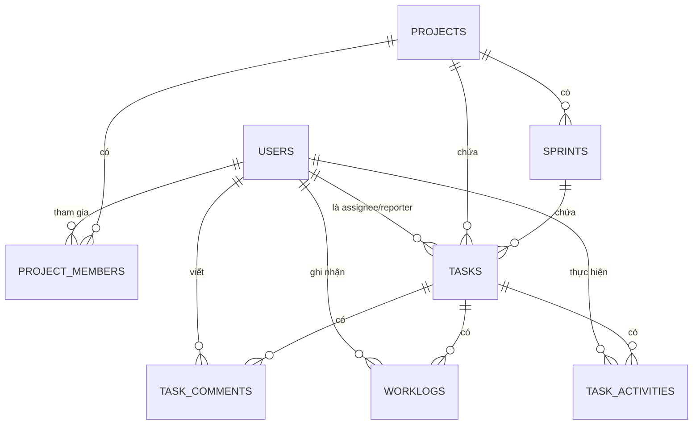

# SYSTEM ARCHITECTURE DOCUMENT
## Mini Project Management System (Jira-like)

| Thông tin tài liệu | |
|---|---|
| Phiên bản | 1.0 |
| Nguồn | Biên soạn dựa trên `SRS-Mini-Project-Management-System.md` |
| Phạm vi | Kiến trúc Backend, Frontend, Bảo mật, Dữ liệu, Triển khai |

---

## 1. Giới thiệu

### 1.1 Mục đích
Tài liệu mô tả kiến trúc kỹ thuật của hệ thống, làm cơ sở để đội phát triển triển khai đồng nhất, tránh mỗi module tự chọn cách tổ chức code khác nhau.

### 1.2 Nguyên tắc thiết kế
- **Đơn giản, phù hợp timeline 5 ngày / 8 dev** — ưu tiên kiến trúc dễ triển khai, dễ chia việc song song, không over-engineer.
- **Monolith theo Layered Architecture** thay vì Microservices — quy mô nhỏ, team không đủ để vận hành nhiều service độc lập trong 5 ngày.
- **Package-by-feature** ở Backend — mỗi Dev sở hữu trọn package của module mình, giảm xung đột code khi 8 người code song song.
- **Stateless API** — toàn bộ trạng thái phiên nằm ở JWT, không lưu session phía server, dễ scale ngang nếu cần.

### 1.3 Tài liệu liên quan
`SRS-Mini-Project-Management-System.md` — đặc tả yêu cầu chức năng/phi chức năng làm đầu vào cho tài liệu này.

---

## 2. Kiến trúc tổng quan

Kiến trúc 3 tầng (3-tier): **Client (Angular) → REST API (Spring Boot, layered) → Database (PostgreSQL)**.



Các layer trong tầng Backend giao tiếp một chiều từ trên xuống (Controller → Service → Repository), không cho phép Controller gọi thẳng Repository hoặc Repository gọi ngược lên Service, nhằm giữ business logic tập trung ở Service Layer.

---

## 3. Kiến trúc Backend (Spring Boot)

### 3.1 Vai trò từng layer

| Layer | Trách nhiệm |
|---|---|
| **Controller** | Nhận request, validate input (Bean Validation), gọi Service, trả response theo `ApiResponse<T>` chuẩn |
| **Service** | Xử lý nghiệp vụ, quản lý transaction boundary (`@Transactional`), gọi Repository và các service phụ trợ (vd. `ActivityLogService`) |
| **Repository** | JPA Repository; dùng `Specification`/QueryDSL cho các truy vấn động (Task Search — FR-TASK-04) |
| **Entity/Domain** | JPA Entity ánh xạ 10 bảng trong SRS mục 6 |
| **DTO/Mapper** | Tách biệt Entity khỏi API contract, tránh lộ cấu trúc DB ra ngoài |
| **Cross-cutting** | Security Filter (JWT), `GlobalExceptionHandler`, Logging Filter, Validation |

### 3.2 Cấu trúc package đề xuất (package-by-feature)

```
com.company.pms
├── config/            # SecurityConfig, JacksonConfig
├── security/          # JwtTokenProvider, JwtAuthFilter, UserDetailsServiceImpl
├── common/            # ApiResponse, PageResponse, GlobalExceptionHandler, BaseEntity
├── auth/              # Dev 1
├── user/              # Dev 2  — controller, service, repository, dto, entity
├── project/           # Dev 3
├── projectmember/     # Dev 3
├── sprint/            # Dev 4
├── task/              # Dev 5, Dev 6
├── comment/           # Dev 7
├── activity/          # Dev 7
├── worklog/           # Dev 8
├── dashboard/         # Dev 8
└── report/            # Dev 8
```

Mỗi package con theo module tự chứa `controller/`, `service/`, `repository/`, `dto/`, `entity/` riêng — giữ nguyên cách phân công nhân sự đã thống nhất trước đó (mỗi Dev sở hữu trọn 1-2 package).

---

## 4. Kiến trúc Frontend (Angular)

### 4.1 Cấu trúc module

| Khối | Nội dung |
|---|---|
| `core/` | Interceptor (gắn JWT, xử lý 401), Guard (Auth, Role), service dùng chung toàn app |
| `shared/` | Component dùng chung: table, pagination, modal, toast |
| `features/*` | Module theo domain nghiệp vụ (auth, user, project, sprint, task, worklog, dashboard, report), lazy-load |
| `layout/` | Sidebar, Header, khung layout chính |

```
src/app
├── core/
├── shared/
├── layout/
└── features/
     ├── auth/
     ├── user/
     ├── project/
     ├── sprint/
     ├── task/
     ├── worklog/
     ├── dashboard/
     └── report/
```

### 4.2 Quản lý state
Dùng **Angular Service + RxJS (`BehaviorSubject`)** cho từng feature module, **không dùng NgRx** — quy mô dữ liệu và thời gian dự án không đủ để bù đắp chi phí boilerplate của NgRx.

### 4.3 Routing
Lazy-load theo feature module; `RoleGuard` chặn truy cập route theo System Role (vd. `/admin/users` chỉ Administrator vào được).

---

## 5. Kiến trúc bảo mật

### 5.1 Luồng xác thực JWT
1. Người dùng đăng nhập (`POST /api/auth/login`) → hệ thống xác thực Username/Password (BCrypt) → cấp **Access Token** (thời hạn ngắn) + **Refresh Token** (thời hạn dài). Cả hai token này đều là stateless JWT được ký bởi Backend; **Backend không lưu trữ token trong Database/Redis** mà chỉ thực hiện verify tính hợp lệ.
2. Mọi request tiếp theo gửi kèm `Authorization: Bearer <access_token>`
3. Access Token hết hạn → Frontend gọi `POST /api/auth/refresh` bằng Refresh Token → Backend verify chữ ký Refresh Token và cấp Access Token mới.
4. Đăng xuất → Frontend tự động xóa Access Token và Refresh Token khỏi nơi lưu trữ (cookie/localStorage/sessionStorage) phía Client.

### 5.2 Phân quyền hai lớp
- **Lớp 1 — System Role** (`ADMIN`/`PM`/`DEV`): áp dụng bằng `@PreAuthorize` ở Controller/Service, chặn ngay tại cổng vào API.
- **Lớp 2 — Project Role** (`PM`/`DEV`/`TESTER` theo từng Project): kiểm tra ở tầng Service — vd. chỉ PM **thuộc đúng Project** mới được tạo Sprint trong Project đó; chỉ Assignee **thuộc cùng Project** mới nhận được Task (đúng ràng buộc FR-TASK-03 trong SRS).

### 5.3 Mã hoá
Mật khẩu lưu dạng băm BCrypt, không lưu plaintext ở bất kỳ tầng nào.

---

## 6. Kiến trúc dữ liệu

### 6.1 Sơ đồ quan hệ (ERD)


### 6.2 Chỉ mục (index) khuyến nghị cho hiệu năng
Để đạt NFR-05 (phản hồi < 3s với ~10.000 task), cần đánh index trên các cột thường dùng để lọc trong Task Search (FR-TASK-04):

| Bảng | Cột nên đánh index |
|---|---|
| `tasks` | `project_id`, `sprint_id`, `status`, `priority`, `assignee_id` |
| `worklogs` | `task_id`, `work_date` |
| `task_activities` | `task_id`, `created_time` |
| `project_members` | `project_id`, `user_id` |
| `sprints` | `project_id` |

---

## 7. Kiến trúc triển khai (Deployment)

Với timeline 5 ngày, đề xuất triển khai đơn giản bằng **Docker Compose** — 3 container, không cần Kubernetes hay CI/CD phức tạp:

| Container | Image | Port | Ghi chú |
|---|---|---|---|
| `pms-db` | `postgres:16` | 5432 | Volume mount để không mất data khi restart |
| `pms-backend` | Spring Boot jar (build multi-stage) | 8080 | Đọc config qua biến môi trường (DB URL, JWT secret) |
| `pms-frontend` | Angular build, serve qua Nginx | 80 | Nginx reverse-proxy `/api` sang `pms-backend:8080` |

> **Khuyến nghị:** Dev1 chuẩn bị `docker-compose.yml` ngay từ Ngày 1 và build thử định kỳ mỗi ngày — tránh việc đóng gói/triển khai bị dồn vào Ngày 5 rồi mới phát hiện lỗi.

---

## 8. Luồng xử lý chính (Key Flows)

### 8.1 Luồng đăng nhập
`Client → POST /api/auth/login → AuthController → AuthService → UserRepository (kiểm tra) → JwtTokenProvider (sinh token) → Client lưu token`

### 8.2 Luồng cập nhật trạng thái Task (kèm ghi Activity Log)
`Client → PATCH /api/tasks/{id} → TaskController → TaskService.updateStatus() → validate luồng trạng thái hợp lệ (FR-TASK-02) → TaskRepository.save() → gọi ActivityLogService.log("Status Changed", old, new) → TaskActivityRepository.save() → trả response`

### 8.3 Luồng tìm kiếm Task đa điều kiện
`Client → GET /api/tasks/search?project=&sprint=&status=&priority=&assignee=&keyword= → TaskController → TaskService → TaskSpecification (build query động) → TaskRepository → PageResponse<TaskDto>`

---

## 9. Xử lý lỗi & Logging

- **GlobalExceptionHandler** (`@ControllerAdvice`) bắt mọi exception, map sang HTTP status phù hợp, trả về theo cấu trúc lỗi thống nhất trong `ApiResponse` — không để lộ stack trace hay chi tiết hệ thống ra ngoài.
- **Logging Filter/AOP**: ghi log mỗi request (method, URI, thời gian xử lý) ở mức INFO, ghi exception kèm stack trace ở mức ERROR — đáp ứng NFR-07.

---

## 10. Ánh xạ yêu cầu phi chức năng vào kiến trúc

| NFR (theo SRS) | Giải pháp kiến trúc |
|---|---|
| NFR-01, NFR-03 — JWT, Role-based Authorization | Security Filter + `@PreAuthorize` hai lớp (mục 5.2) |
| NFR-02 — Mã hoá mật khẩu | BCrypt tại Service Layer khi tạo/cập nhật User |
| NFR-04 — Phân trang | `Pageable`/`PageResponse<T>` áp dụng thống nhất mọi API danh sách |
| NFR-05 — Hiệu năng < 3s / 10.000 task | Index DB (mục 6.2) + query động qua Specification thay vì load toàn bộ rồi filter ở code |
| NFR-06 — Audit | `ActivityLogService` ghi `task_activities` mỗi khi Service thực hiện thay đổi |
| NFR-07 — Logging | Logging Filter/AOP (mục 9) |

---

## 11. Công nghệ & thư viện

| Thành phần | Lựa chọn |
|---|---|
| Backend Framework | Spring Boot |
| ORM | JPA/Hibernate |
| Query động | Spring Data JPA Specification |
| Bảo mật | Spring Security + JJWT |
| Validation | Jakarta Bean Validation |
| Cơ sở dữ liệu | PostgreSQL |
| Frontend Framework | Angular |
| HTTP Client | Angular `HttpClient` + RxJS |
| Đóng gói | Docker, Docker Compose |

---

## 12. Quyết định kiến trúc quan trọng (tóm tắt)

| # | Quyết định | Lý do |
|---|---|---|
| 1 | Monolith thay vì Microservices | Timeline 5 ngày, team nhỏ, tránh chi phí vận hành nhiều service |
| 2 | JWT stateless (cả Access & Refresh Token) | Backend không cần lưu trữ token, giảm tải DB và đơn giản hóa logic logout/refresh |
| 3 | Angular Service + RxJS thay vì NgRx | Giảm boilerplate, phù hợp quy mô dự án nhỏ trong 5 ngày |
| 4 | Package-by-feature (Backend) | 8 dev làm song song, giảm tối đa xung đột merge |
| 5 | Docker Compose thay vì Kubernetes | Không cần scale phức tạp cho một hệ thống nội bộ quy mô nhỏ |

---

## 13. Rủi ro kiến trúc & giảm thiểu

| Rủi ro | Giảm thiểu |
|---|---|
| Query tìm kiếm Task đa điều kiện chậm khi thiếu index | Thêm index sớm (mục 6.2), test với data lớn từ Ngày 3–4 |
| Đóng gói Docker lần đầu tốn thời gian nếu để cuối dự án | Dev1 dựng `docker-compose.yml` từ Ngày 1, build thử hằng ngày |
| Hai lớp phân quyền (System Role + Project Role) dễ bị code thiếu ở Service Layer nếu không thống nhất sớm | Thống nhất pattern kiểm tra Project Role thành 1 hàm dùng chung (vd. `projectMemberService.assertMember(projectId, userId)`), mọi Service gọi lại thay vì tự viết logic riêng |
